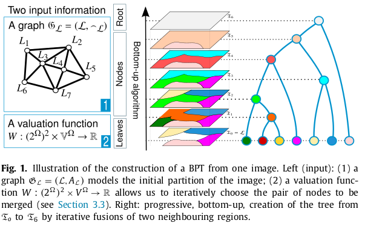
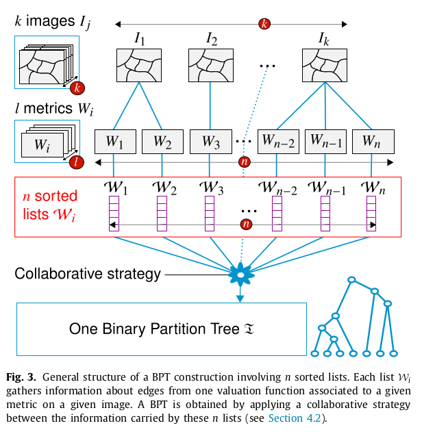

# Binary Partition Tree construction from multiple features for image segmentation
Java implementation of [Binary Partition Tree construction from multiple features for image segmentation](https://www.sciencedirect.com/science/article/abs/pii/S0031320318302358) published in the Pattern Recognition journal in 2018.

## Authors
Jimmy Francky Randrianasoa, Camille Kurtz, Éric Desjardin, Nicolas Passat

## Abstract
In the context of image analysis, the Binary Partition Tree (BPT) is a classical data structure for the hierarchical modelling of images at different scales. BPTs belong both to the families of graph-based models and morphological hierarchies. They constitute an efficient way to define sets of nested partitions of image support, that further provide knowledge-guided reduced research spaces for optimization-based segmentation procedures. Basically, a BPT is built in a mono-feature way, i.e. for one given image, and one given metric, by merging pairs of connected image regions that are similar in the induced feature space. Our goal is to design a new family of BPTs, dealing with the need to directly manage multiple features within its building process. Then, we propose a generalization of the BPT construction framework, allowing one to embed multiple features. The cornerstone of our approach relies on a collaborative strategy used to establish a consensus between different metrics, thus enabling to obtain a unified hierarchical segmentation space. In particular, this provides alternatives to the complex issue of metric construction from several —possibly non-comparable— features. To reach that goal, we first revisit the BPT construction algorithm to describe it in a graph-based formalism. Then, we present the structural and algorithmic evolutions and impacts when embedding multiple features in BPT construction. Final experiments illustrate how this multi-feature framework can be used to build BPTs from multiple metrics computed through the (potentially multiple) image content(s).

## Illustrations

---

# BinaryPartitionTree

<b>BPT:</b> Binary Partition Tree  
<b>MBPT:</b> Multi-feature Binary Partition Tree

<b>Language:</b> Java  
<b>Purpose:</b> Creating and managing BPT and MBPT  

<b>Core classes:</b>  
&bull; [BPT](src/standard/sequential/BPT.java) 
&bull; [MBPT](src/multi/sequential/MBPT.java)  

<b>Project dependency:</b> 
[Image](https://github.com/yonmi/Image)  
<b>Getting started:</b> you can start with some [examples](src/examples)
